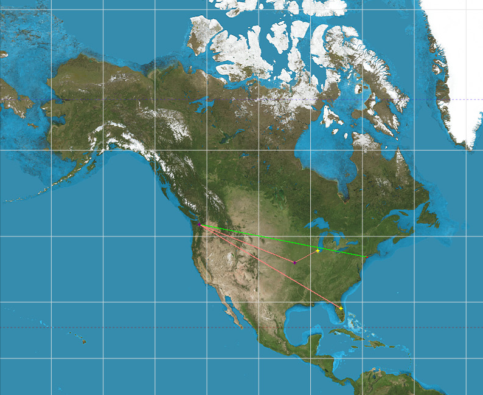
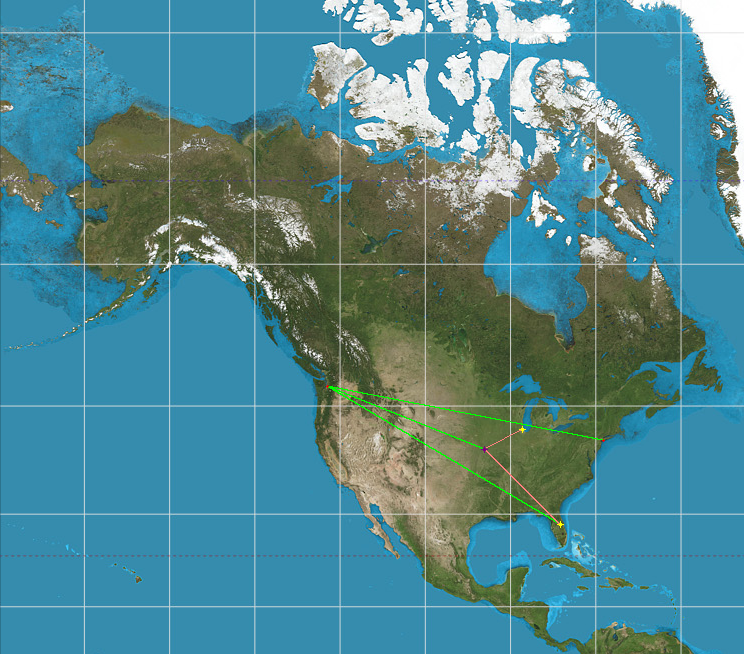
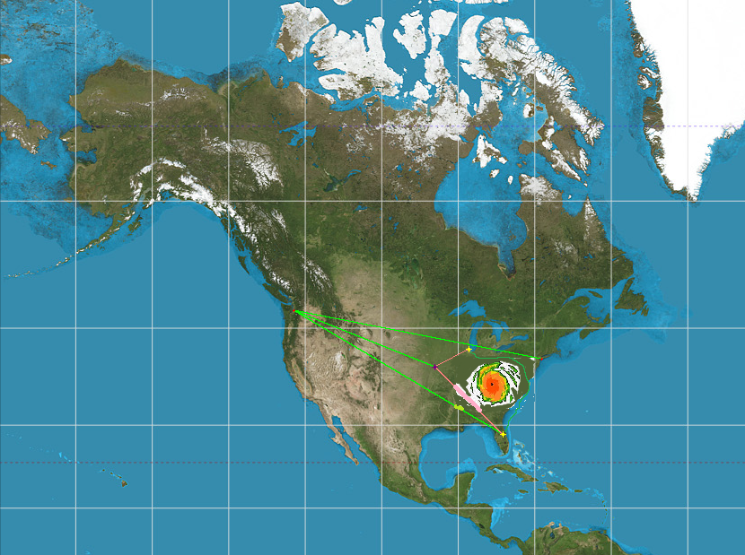
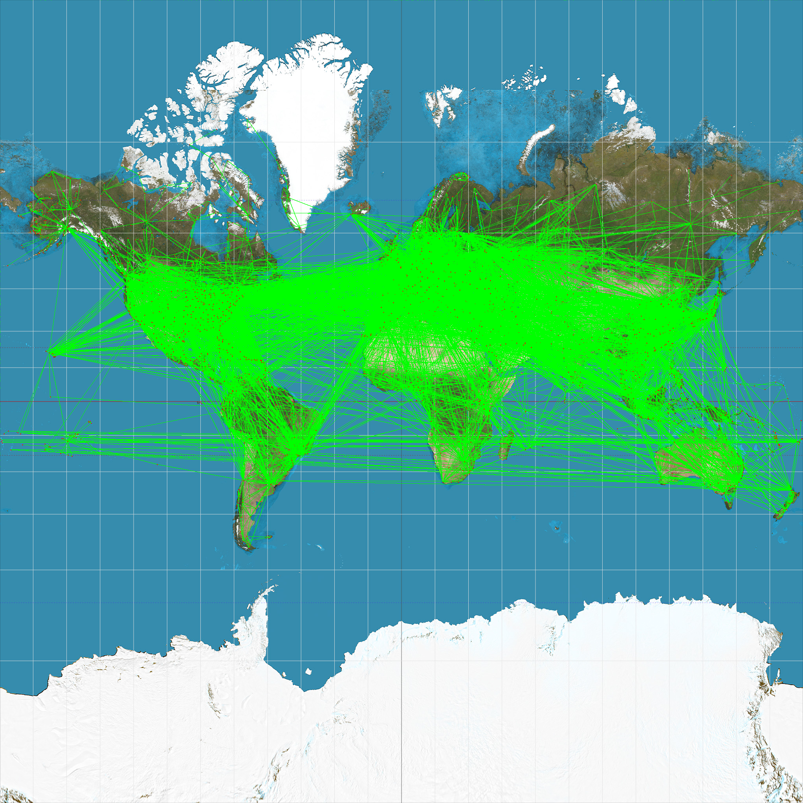
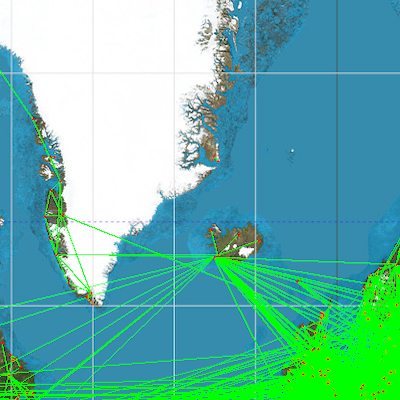
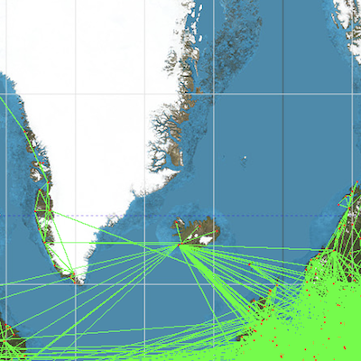

## Final Results Report

## Data Cleaning, Representation, and Graph Constructor

### Data Cleaning

The data from openflights was fairly clean. There are a handful of routes in the list that had massing source/destination IDs and some that referenced airports that were not in the airports file, they were skipped over and not loaded into the graph.

### Data Representation

The vertices in our graph are airport objects which store the airport names and IDs as well as a list of pointers to Route objects, which represent edges in our graph. The FlightGraph class maintains a hash table of each airport ID mapped to its airport object including the adjacency list.

### Graph Constructor

The parameterized FlightGraph constructor reads the airport and routes CSV files and loads the data into memory. The data is sanatized by the loadAirports and loadRoutes functions for which the constructor is essentially a wrapper. Any line in the CSV file that does not conform to the standard format or references GPS coordinates outside the valid range is skipped and not loaded into memory.

## Dijkstra's Single Source Shortest Path Algorithm

### Runtime Efficiency

To initialize the vector of airports and hash map of distances executes O(|V|) operations.

Subtotal: O(|V|)

Next, to build our priority queue takes O(|V|) time.

Subtotal: O(2|V|)

We loop until the priority queue is empty, popping an element on each loop iterations, giving us |V| loop iterations for the outer loop. The popping from the priority queue implemented with a binary heap of airports takes O(log|V|). Inside that loop we will look at each connected airport in the adjacency list which will take 2|E| operations.

Subtotal: O(2|V| + |V|*2|E| + |V|log(|V|))

Finally, to retrace the path from the destination in the SSSP graph takes O(|V|) time.

Total: O(3|V| + |V|*2|E| + |V|log(|V|))

### Correctness Tests

### Test Case "Dijkstra_pair"
Input datasets: `tests/datasets/pair.dat`, `tests/datasets/pair_route.dat`
The most basic test, given only two airports and a single route between them. That single route should be the solution.

### Test Case "Dijkstra_Disney1"
Input datasets: `tests/datasets/usa/airports.dat`, `tests/datasets/usa/routes1.dat`
The Disney test cases search for the shortest route from O'Hare in Chicago to Disney World (Orlando International, MCO). They all use the same set of six airports inside the United States but they each use a different set of routes. The visualization function uses red/pink to color the shortest path and green to color other edges.

### Test Case "Dijkstra_Disney2"
Input datasets: `tests/datasets/usa/airports.dat`, `tests/datasets/usa/routes2.dat`
This test is the same as "Dijkstra_Disney1" except that the route set includes a route from Kentucky (MCI) to Orlando.

### Test Case "Dijkstra_Disney_Detour"
Input datasets: `tests/datasets/usa/airports.dat`, `tests/datasets/usa/routes3.dat`
the routes3.dat file is the same as routes2.dat except that it includes a route directly from O'Hare to Orlando International. Our parameterized constructor and loadRoutes function use the real distance between the two airports to setup graph edge weights, however for the purposes of testing the correctness of the algorithm implementation we can imagine a situation in which perhaps there is a storm or something blocking the direct path between the two points, provoking a detour in the route.
The Dijkstra_Disney_Detour test updates the direct flight rought to have a distance of 3x the direct path so that the flight through Kentucky still is chosen in the shortest path. The following image is not a direct result of our program but a modified image with a hurricane inserted inbetween Chicago and Florida to illustrate the test code.

### Test Case "Dijkstra_NoPath"
Input datasets: `tests/datasets/usa/airports.dat`, `tests/datasets/usa/routes2.dat`
This test tries to find a path from O'Hare, a commercial airport, to Hunter Army Air Field, a military facility, between which no connected path exists. The test verifies that an empty list is returned.

## Depth First Traversal

### Runtime Efficiency

#### Single Source: O(|V| + |E|)

Depth First Traversal at a single source airport will have a runtime of O(|V| + |E|). Our implementation utilizes a stack of Route* which are edges in the FlightGraph as well as a visited table. The algorithm runs until the stack is empty, and at each iteration, it pops off the stack, marks the destination airport as visited, and adds the neighboring routes of the destination airport to the stack. So, it must visit each route and each airport in the component of the source airport. However, it is possible that the component is the entire graph, giving a runtime of O(|V| + |E|) where V is the set of airports, and E is the set of routes.

#### Traversal Over Entire Graph: O(|V| + |E|)

Depth First Traversal over the entire Flight Graph will have a runtime of O(|V| + |E|). Our implementation traverses over all airports and performs a single source Depth First Traversal on any unvisited airports. So, Depth First Traversal over the entire graph will run the single source traversal once over each component of the graph. Thus, the algorithm must visit each route and each airport in the entire graph, giving a runtime of O(|V| + |E|) where V is the set of airports, and E is the set of routes.

### Correctness Tests

### Test Case "Depth-First-Search 2 Routes 1 Source"
Input datasets: `tests/datasets/airports_small.dat`, `tests/datasets/airports_small_routes1.dat`
Small test case which tests the order of the Depth First Traversal. This test case as 2 airports connected to one source airport via one route each. Due to the order of the traversal, both airports should have the source airport as the most immediate predecessor.

### Test Case "Depth-First-Search No Routes"
Input datasets: `tests/datasets/airports_small.dat`
Small test case which tests the order of the Depth First Traversal as well as the number of components when no airports are connected. Since there are no airports, there should be 3 components in the graph.

### Test Case "Depth-First-Search 2 Routes 2 Sources"
Input datasets: `tests/datasets/airports_small.dat`, `tests/datasets/airports_small_routes2.dat`
Small test case which tests the order of the Depth First Traversal as well as the number of components when all airports are connected. This test case contains 3 airports connected in a chain. Thus, there should be one source airport, an airport with the source airport as the immediate predecessor, and an airport with the previous airport as the immediate predecessor.

DFS Visuals

Below is a Depth First Traversal starting at O'hare. As expected, O'hare essentially connects to almost any other airport in the world.

A closer look indicates that O'hare misses a few airports. For example, in Greenland. There is a tiny component on the right edge of Greenland which is missing from the component containing O'hare.

Complete Graph Traversal (Left)

O'hare Traversal (Right)

 
